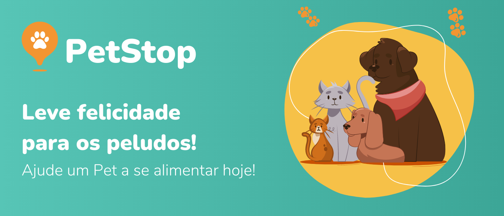

# Sistema de Monitoramento de Pontos de Hidratação e Alimentação dos animais em vulnerabilidade urbana

Petstop - é um projeto de monitoramento de pontos de hidratação e alimentação para animais em situação de rua. O objetivo é fornecer uma ferramenta que possibilite aos voluntários e organizações monitorar e gerenciar a alimentação e a hidratação dos animais de rua em suas áreas, para que eles possam receber os cuidados essenciais para o seu bem-estar.

## Tecnologias Utilizadas

- HTML
- CSS
- JavaScript
- NodeJs

## Status do Projeto

<g-emoji class="g-emoji" alias="construction" fallback-src="https://github.githubassets.com/images/icons/emoji/unicode/1f6a7.png">🚧</g-emoji> Este projeto está em construção. Ainda está em fase de desenvolvimento e aprimoramento.

## Licença

Este projeto está sob a licença [MIT](LICENSE).
